# Deploying the Chime Voice connector Agent Assist Solution

Now that we have the Amazon Chime Transcription solution installed, we can move ahead and setup the Agent Assist solution.

In order to get started we will need to satisfy some requirements in our development environment, which in my case, is an ec2 instance.

Also, because we will be hosting the web interface with [_AWS Amplify_](https://aws.amazon.com/amplify/) we will need a repository setup.

We will also need to install jq

### Installing nvm and npm

First step will be install [_nvm_](https://github.com/nvm-sh/nvm) and [_npm_](https://www.npmjs.com/get-npm)

For NVM we will follow the instructions available on their github repo, in my case:

`wget -qO- https://raw.githubusercontent.com/nvm-sh/nvm/v0.35.3/install.sh | bash`
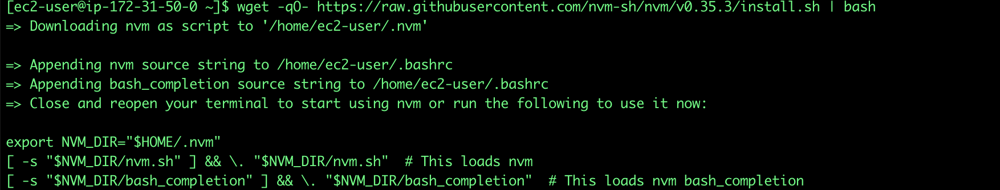
After nvm is installed, logout and log back to simulate the terminal restart.

As for npm, once nvm is installed, can be installed:

`nvm install node`
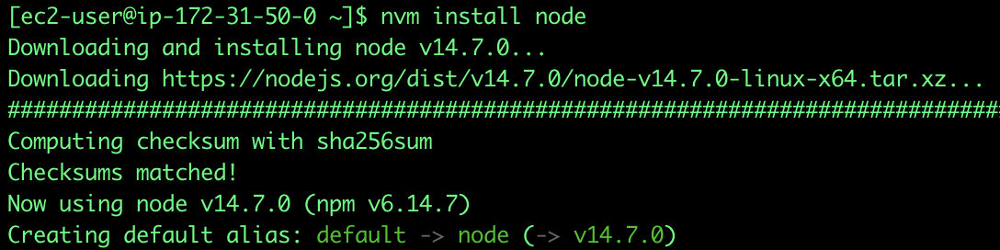
### Installing the AWS Amplify CLI

Details about how to deploy the amplify console can be found on AWS Amplify’s [_documentation site_](https://docs.amplify.aws/cli/start/install).

In summary, what we need to do is to configure our console and also create a user with the AdministratorAccess permissions to provision the AWS resources needed by the Agent Assist solution to run.

First step will be to download and install the Amplify CLI:

`npm install -g @aws-amplify/cli`

Second step, requires to follow the installation steps:

`amplify configure`
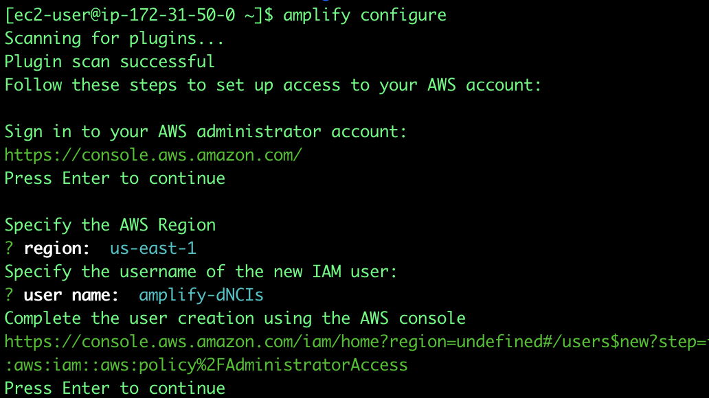
Essentially here we will define the region where our user will be created and the username we would like to have, this will generate an URL that will take us the AWS console to provision the user.

All the settings will be defined so just move through the user creation process without making any changes.

After the new user is created we will be presented with the Access key ID and the Secret Access key, which we will have to enter on the Amplify configuration script:
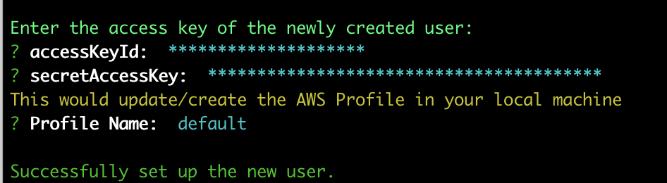
### Installing jq

In order to install [_jq_](https://stedolan.github.io/jq/) we will run the following command:

`sudo yum install jq -y`

### Installing git and cloning the solution repository

For our next step we will need to clone the solution repo, for this we will need have git installed:

`sudo yum install git -y`
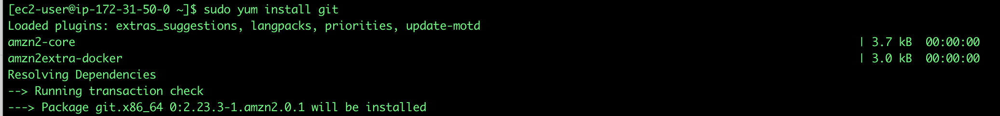
After git is installed, you can clone solution repository:

`git clone https://github.com/aws-samples/chime-voiceconnector-agent-assist.git`
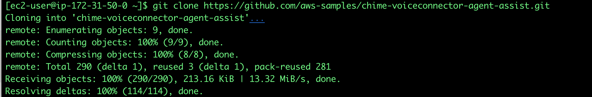
### Installing the package and dependencies

After the repo has been cloned, we will go to the newly created directory and will run the npm install command.

`cd chime-voiceconnector-agent-assist`
`npm install`
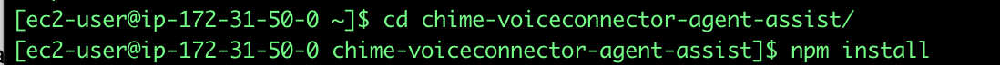
### Initializing and pushing  the AWS Amplify Project

Under the chime-voiceconnector-agent-assist directory we will execute the following command:

`amplify init`
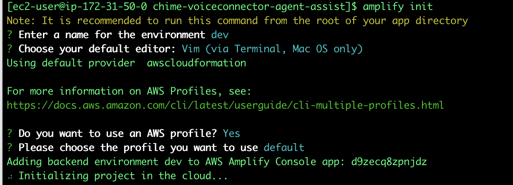
Now that our amplify project has been initialized we can push the infrastructure to the cloud by executing the following command:

`amplify push`
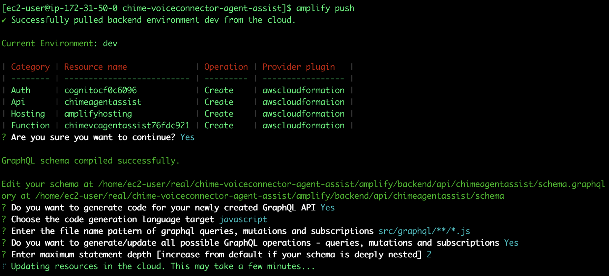
After this process you will see a message similar to this:

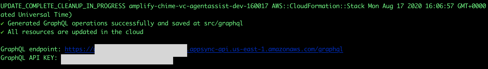
Now its time to push our Search infrastructure to the cloud, we will execute the following command:

`chmod u+x ./infrastructure/deploy_search_infrastructure.sh && ./infrastructure/deploy_search_infrastructure.sh`
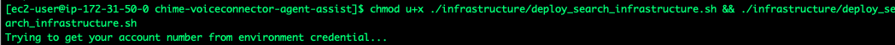
Keep in mind that deploying an [_Elasticsearch_](https://aws.amazon.com/elasticsearch-service/) cluster may take several minutes, once the process is finished you will see a message similar to this:
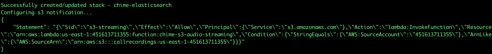
Finally, after the search infrastructure has been deployed, we will pull the environment config and publish the frontend to the cloud. This process may take a long time, if your ssh session gets terminated, check the status of the chime_elasticsearch stack on your CloudFormation console.
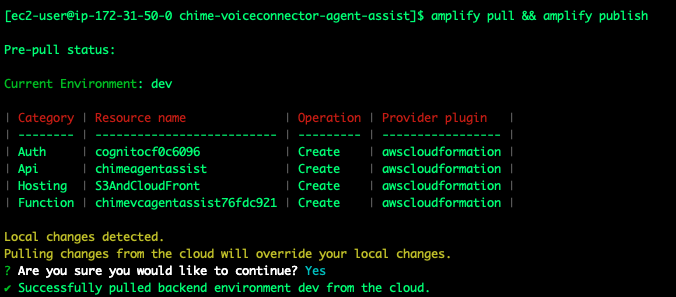
`amplify pull && amplify publish`

After the publishing process is finished, we will get a message stating that our deployment has been completed and you will get the url for the solution.
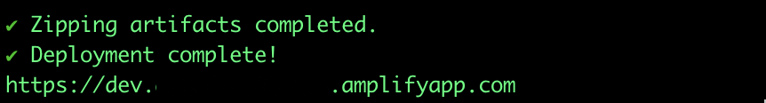
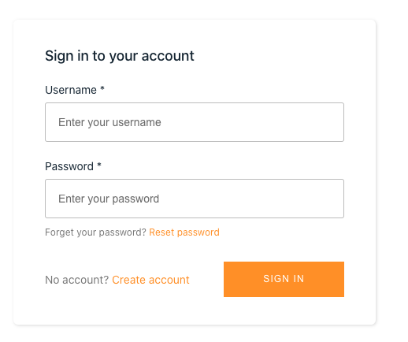
Now we need to create an account, we can do it by clicking on the Create account link next to the “Sign In” button.

After filling the form you will get a confirmation number that will be used to activate your account. This task is achieved by Amazon Cognito, you can find more information [_here_](https://docs.aws.amazon.com/cognito/latest/developerguide/signing-up-users-in-your-app.html).

### Enabling the trust relationship for the auth user role

We will modify the IAM role assigned to the authorized users to be able to be used by Cognito.

On the IAM console, search for "auth" and click for the Auth role:

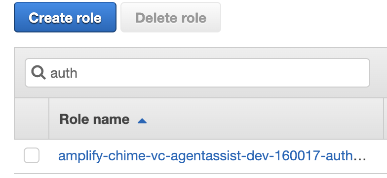
Click on the Trust relationships tab and then on the "Edit trust relationship" button.

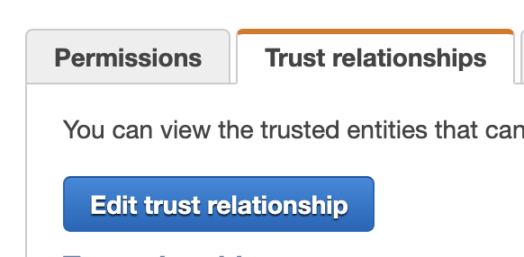
Modify the trust policy so the Effect is "Allow", it should look like this:

```
{
    "Version": "2012-10-17",
    "Statement": [
        {
            "Sid": "",
            "Effect": "Allow",
            "Principal": {
                "Federated": "cognito-identity.amazonaws.com"
            },
            "Action": "sts:AssumeRoleWithWebIdentity"
        }
    ]
}
```

Click on Update Trust policy and it will look like this:

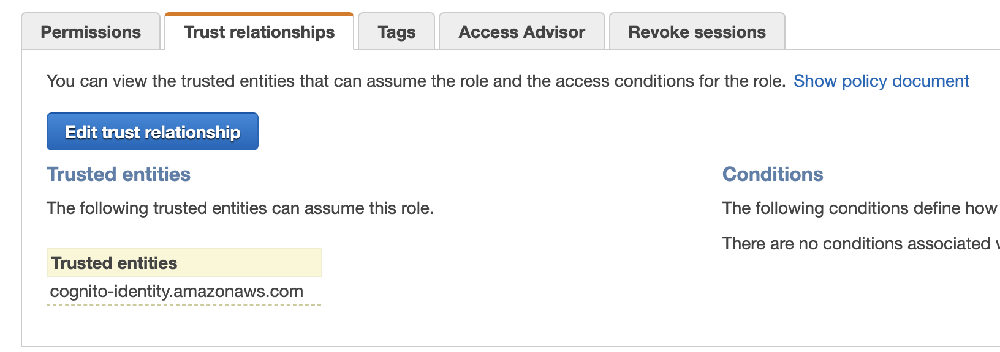


### Creating the Cognito User Group

In order to get access to AWS resources from the Authenticated users, we need to create a Group, this way an IAM role can be assigned to them, to learn more, check [Amazon Cognito Documentation](https://docs.aws.amazon.com/cognito/latest/developerguide/role-based-access-control.html)

We will log into the AWS console and go to Cognito, in there click on "Manage User Pools".

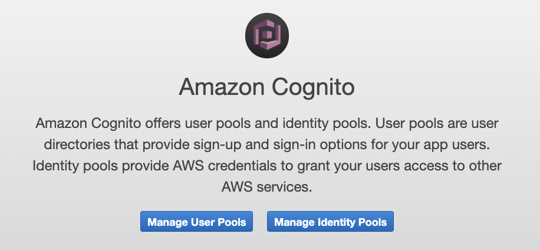
Then select the User pool created by our Cloud Formation Template:

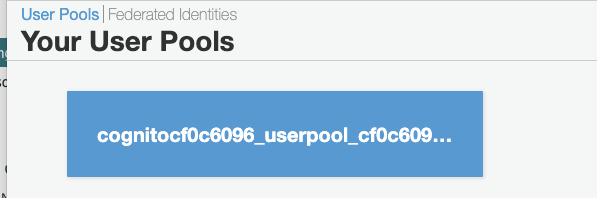
Choose the group tab and then click on "Users and Groups", and then on "Create Group":

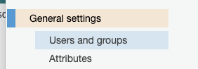
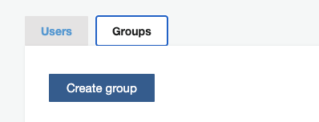

Click on Create group and Enter a name and choose the IAM Role that starts with amplify-chime-vc and ends with AuthGroup

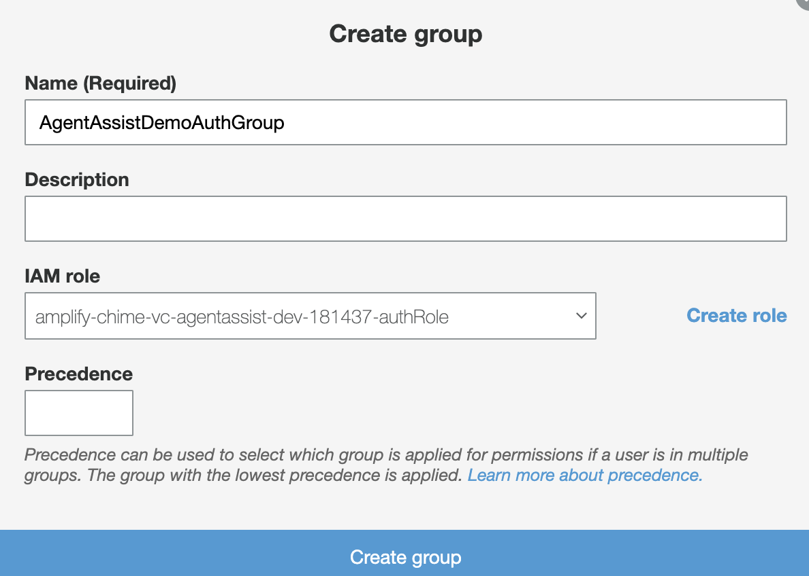

Go back to the Users Tab and click on the username you just created.

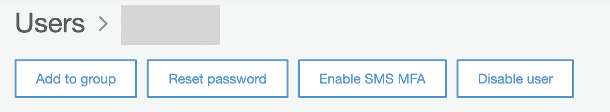

Click on Add to group and select the group we just created, and click on the "Add to group" button:

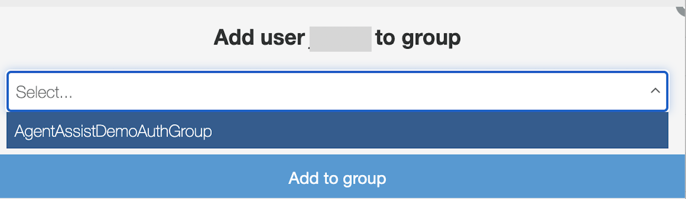