# Deploying an Issabel Server to AWS and using it with the Agent Assist Demo

# 

Now that we have deployed our Amazon  Chime Transcription and Agent Assist solutions, we will proceed to deploy a Unified Communications System to the cloud to test our solution.

Keep in mind that the following guide’s intention is to provide a testing environment and this isn’t by any means a recommended production environment as the resources are estimated for low load, and, the architecture is not designed to accommodate production workloads. Always when designing your architecture refer to the [_Well Architected Framework_](https://aws.amazon.com/architecture/well-architected/).

Issabel is an open source Unified Communications system based on Asterisk. You can find more information on [_https://issabel.org_](https://issabel.org/)

For this portion of the process we are going to deploy an EC2 instance with a Centos 7 AMI, execute the Issabel netinstall script, provision an Amazon Chime phone number and create a SIP trunk between Amazon Chime and our Issabel System.

### Deploying the EC2 Instance

We are going to deploy an EC2 instance with a Centos 7 AMI.

Click on “Launch Instance”:
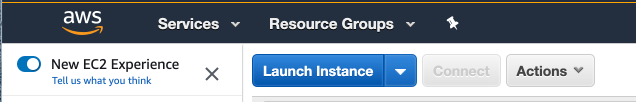
Search for the Official Centos 7 AMI on the AWS Marketplace, which is [_Free Tier_](https://aws.amazon.com/free/) 
Eligible:
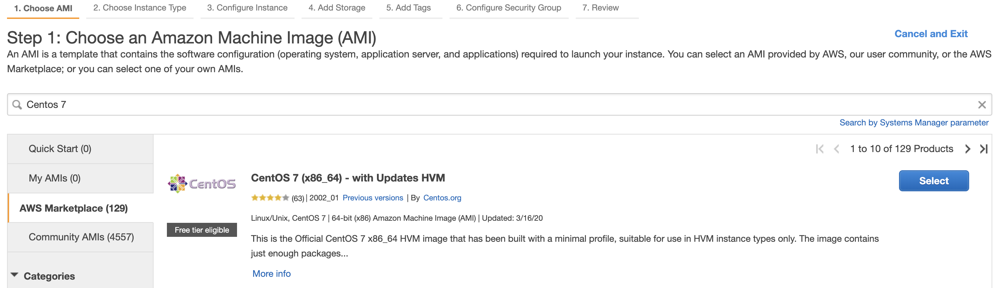
In my case I will run a t2.micro instance, which for testing on 2 SIP channels (the incoming call and a SIP extension that will simulate the agent) should be enough.
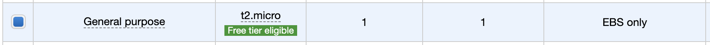

Follow the standard procedure to launch the instance.

Keep in mind that for the CentOS ami the default username is “centos”.

Once our instance is ready we will need to prepare our security group to open Port 22 and 443 for Issabel setup and the required ports for the Amazon Chime SIP Trunk.

You can find Amazon Chime’s full list of ports requirements [_here_](https://docs.aws.amazon.com/chime/latest/ag/network-config.html).

Since I’m running on the us-east-1 region, I will be using the following settings:

|A	|Source	|Port	|
|---	|---	|---	|
|SSH	|Your IP	|TCP/22	|
|---	|---	|---	|
|HTTPS	|Your IP	|TCP/443	|
|Test Softphone	|Your IP	|ALL UDP	|
|	|	|	|
|Amazon Chime / Signaling	|3.80.16.0/23	|UDP/5060	|
|	|	|TCP/5060	|
|	|	|TCP/5061	|
|Amazon Chime / Media	|3.80.16.0/23	|UDP/5000:65000	|
|	|52.55.62.128/25	|UDP/1024:65535	|
|	|52.55.63.0/25	|UDP/1024:65535	|
|	|34.212.95.128/25	|UDP/1024:65535	|
|	|34.223.21.0/25	|UDP/1024:65535	|

It is strongly discouraged to open your security group to any IP address, keep in mind to keep open only the necessary ports.

This is what your inbound rules for your Issabel instance should look like:
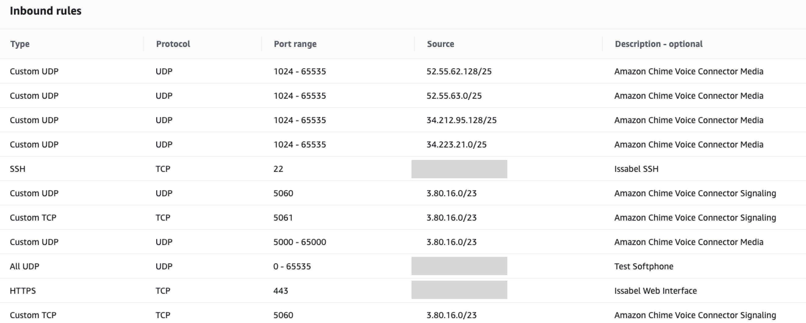
Now that we have our instance ready and that we have configured our security group, we will ssh into, remember the default username for the Official Centos 7 is “centos” .

Once we logged into our instance, we will update the OS and execute the [_Issabel_](https://sourceforge.net/projects/issabelpbx/) netinstall script.

`sudo yum update -y`
`sudo yum install wget -y`

Once we have our tools ready we will elevate ourselves as the root user and execute the netinstall script:

`sudo su`
`wget -O - [**_http://repo.issabel.org/issabel4-netinstall.sh_**](http://repo.issabel.org/issabel4-netinstall.sh) | bash`
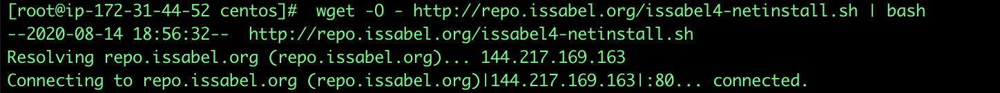
Follow the installation steps.
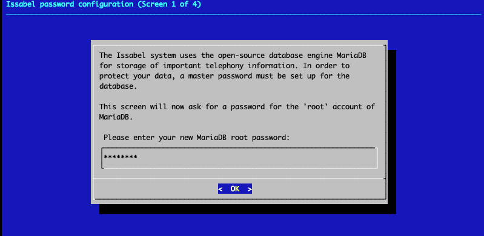Once the installation process finishes you will be able to login into your Issabel, the default username is “admin” and you have already set up the password during the installation:
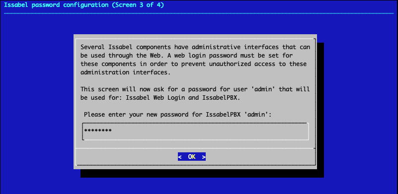We will now go back to AWS console to setup the Amazon Chime Voice connector and the details for the SIP Trunk.

### Ordering a Phone Number for the Chime Voice Connector

On the left menu, we will click on Phone Number Management, then on Orders and finally on the Provision Phone Numbers button:
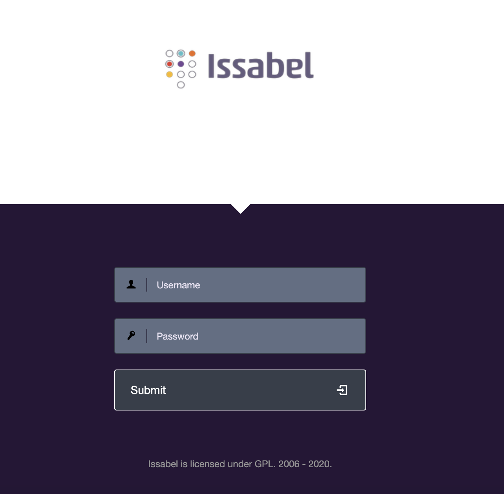
We will choose “Voice Connector”.
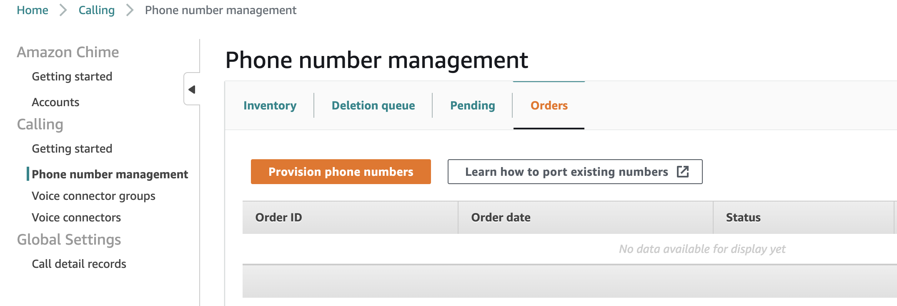
Now its time to choose which phone number we would like to provision, you can either select by State and Location or you can enter a prefix, in my case I’d like a number on the Dallas Region. Select the number you’d like to provision and click provision.
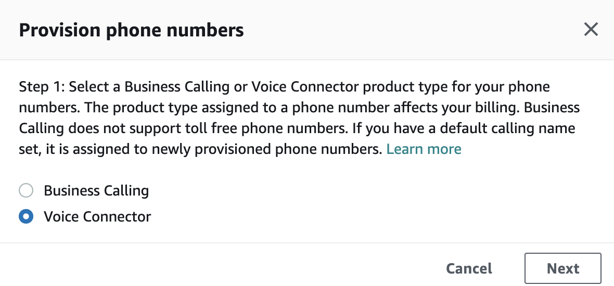
You order will get into the processing stage.
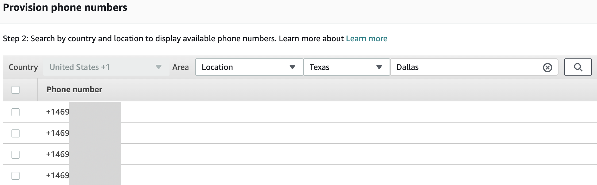
After a couple minutes, the order status will change from Processing to Successful
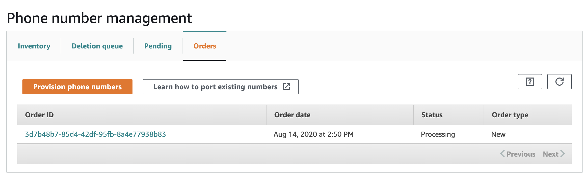
### Creating a Chime Voice Connector

On AWS’ console we will search and click on Chime. Once on the Amazon Chime interface click on Voice Connectors and then on the Create Voice Connector button
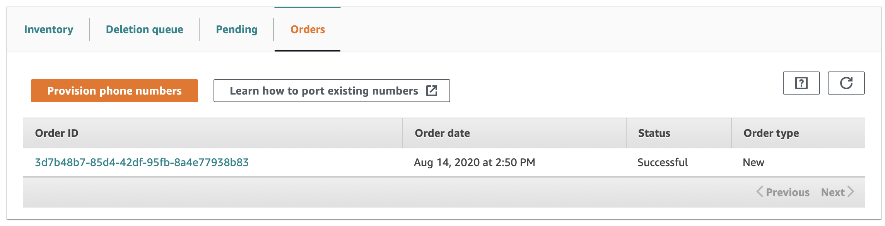
For our next step we need to define a name for the Voice Connecotr, the AWS Region and if it will be encrypted. For our test we are going to Disable encryption, but it is highly encouraged that you enable encryption for production workloads.
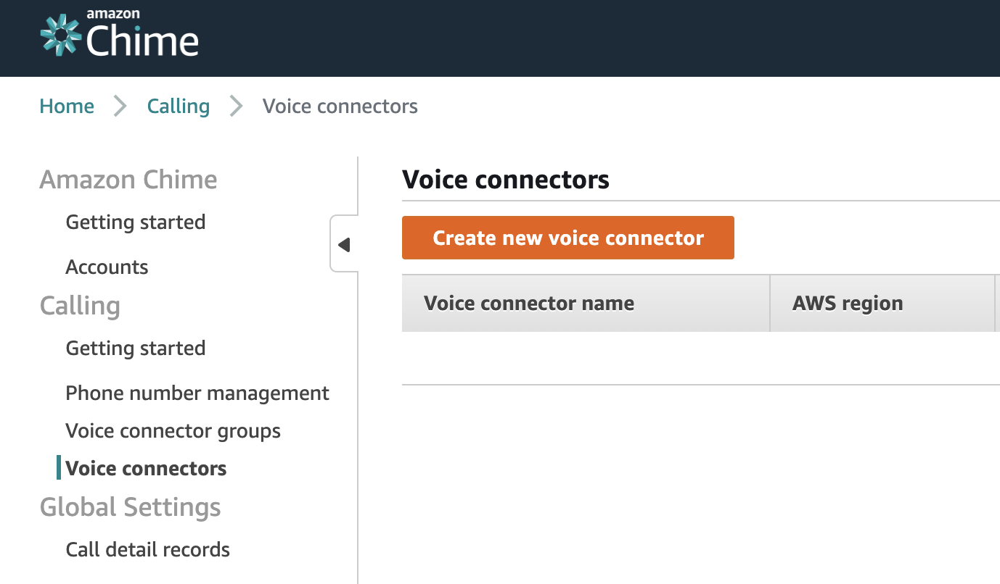
After you enter the required information click on the “Create” button.

We will be taken back to the Voice Connectors list, we will click on the voice connector we recently created.
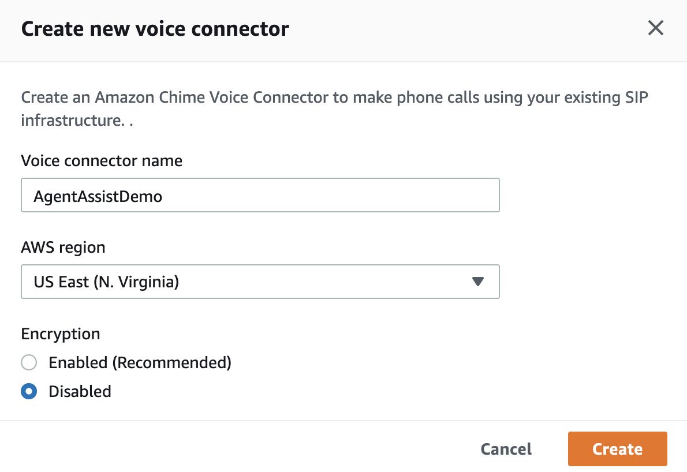
Click on Phone Numbers
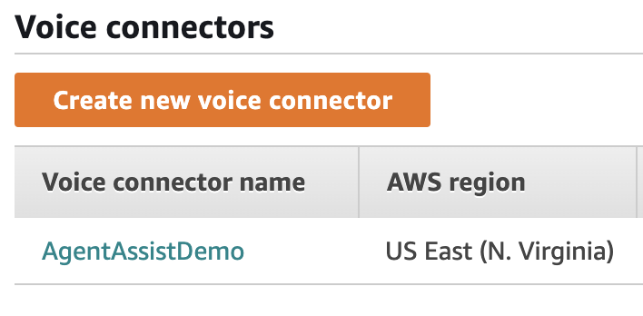
Click on Assign from Inventory

Select the On the inventory list, select the number we just ordered and click on Assign from inventory.
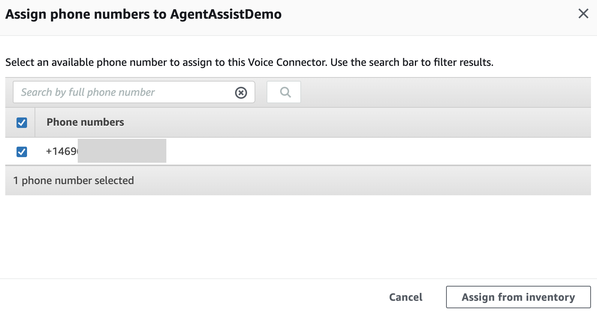
### Setting up the Amazon Chime Connector for call Termination

Now that we have our Amazon Chime Connector configured, and that we have a phone number assigned to it, we can setup the call termination and origination.

For the origination piece we will click on the Termination Tab, and click enable:
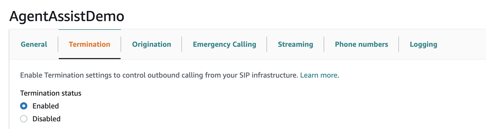
We will take notes of the Outbound host name, we will need it for setting up our SIP trunk.

Under the Allowed hosts list, we will add the public IP of our Issabel server and click “Add”.
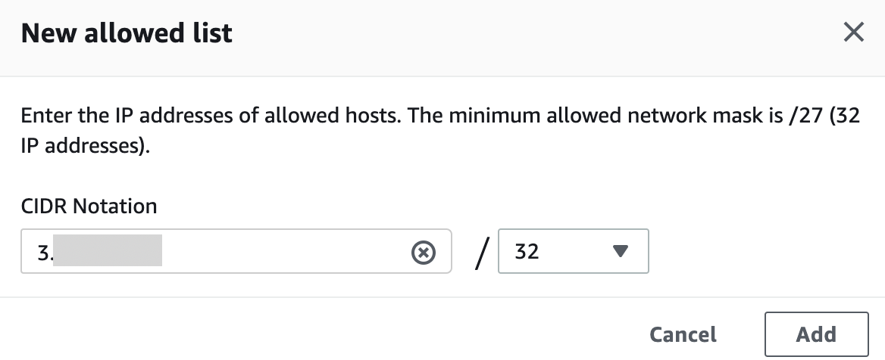
For the calling plan we are going to select United States of America:
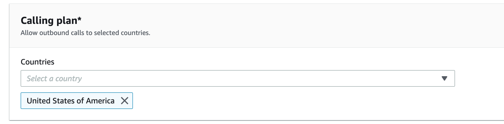
Next, we are going to create a set of credentials, under the Credentials section, click on New:

Enter the username and password you will use to set up your trunk, and click Save:
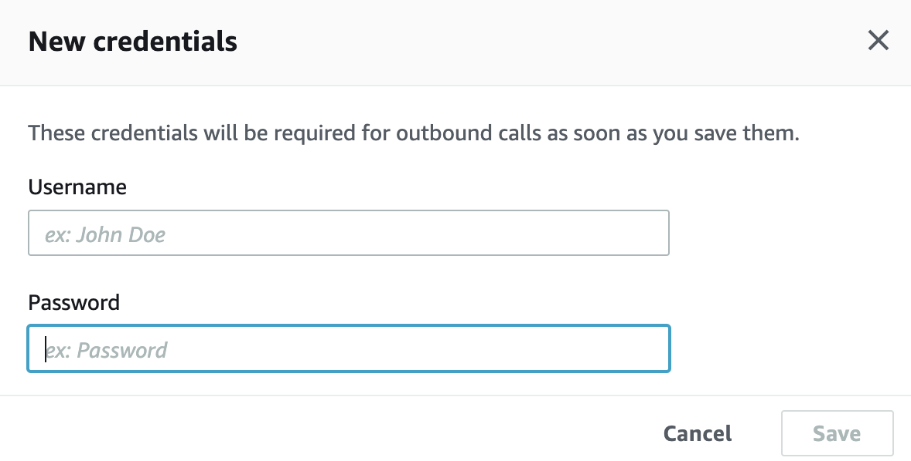
Take note of the following fields:

* Outbound hostname
* Username and Password

Finally at the end of the form, click on Save.

### Setting up the Amazon Chime Connector for call Origination

We will click on Origination at the upper tab of our Amazon Chime Voice Connector configuration screen.
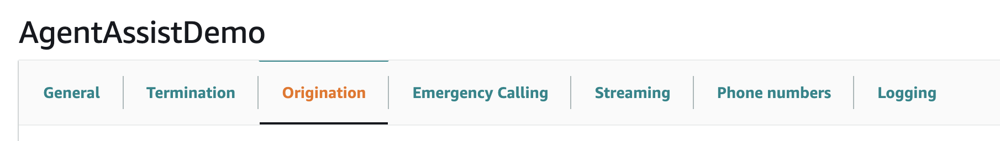
Under Inbound routes click on “New”:

For host enter your Issabel’s server public IP, for protocol we will choose UDP on Port 5060, finally for weight and priority we will enter 1. Once the information is entered, click on “Add”.
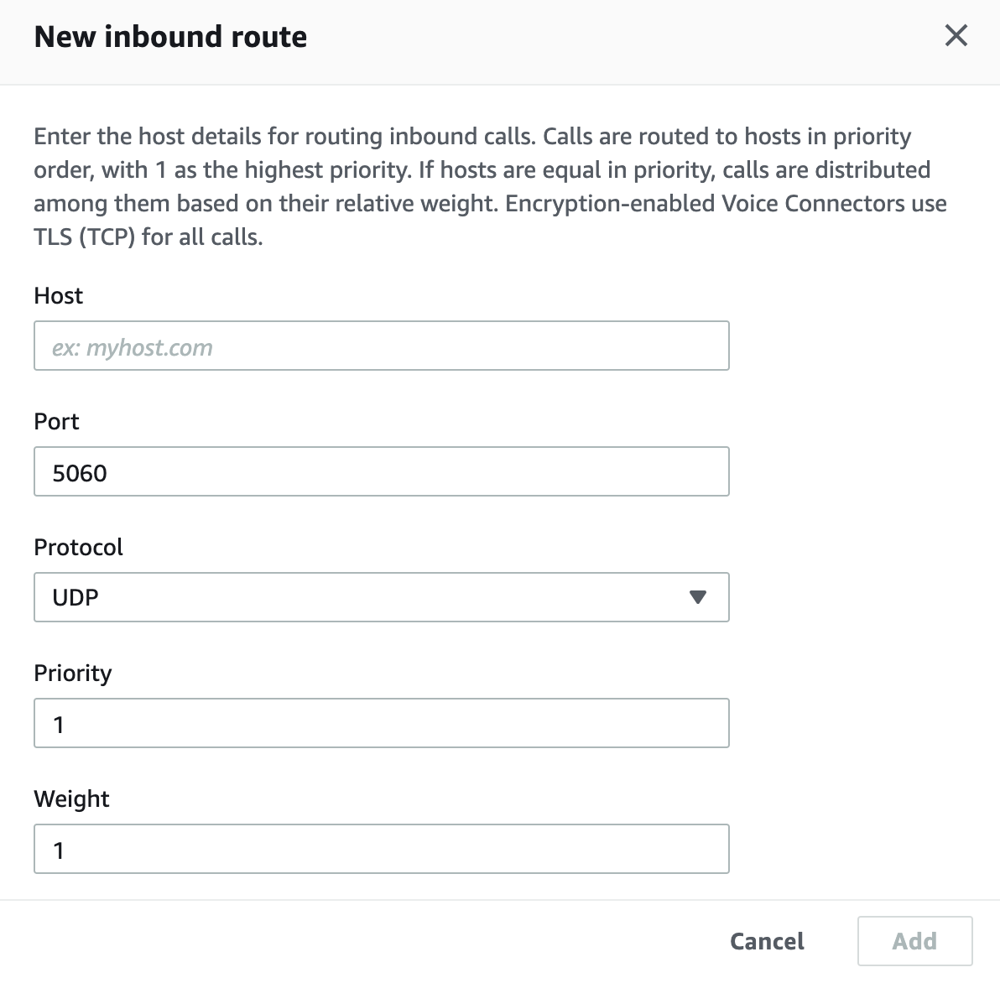Click on Save.

### Enabling sending Kinesis Video Streams

The Amazon Chime Connector has the ability to send Kinesis Video Streams with the call audio, this will be the source of the audio used for our demo.

In order to enable them we need to select Streaming on the top tab, and select Start under Details:
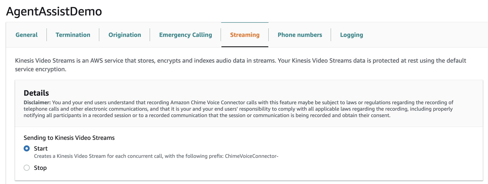
Also under Streaming notification, select EventBridge:
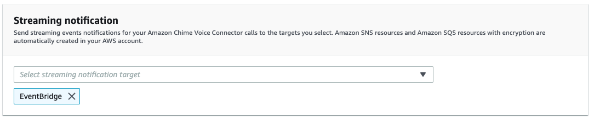
Click on the Save Button.

### Setting up the Amazon Chime Voice Connector SIP Trunk on Issabel

Let’s login into our Issabel server,  by entering on our web https:// followed by your Issabel server’s public IP. You may get an alert that the certificate is not valid, this is normal as the certificate on the server is self signed. For a production workload your are highly encouraged to use valid certificates, for this task you may want to check [_AWS Certificate Manager._](https://aws.amazon.com/certificate-manager/)

Once you have logged into your Issabel server, on the left menu, click on PBX, PBX Configuration:
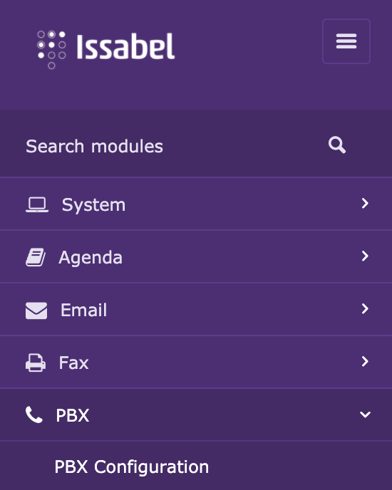
On the new menu that will be displayed inside the frame, click on Trunks
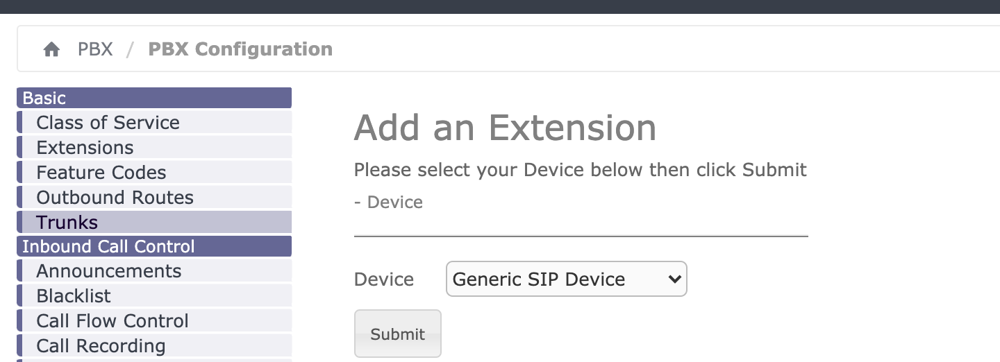
Click on Add Sip Trunk
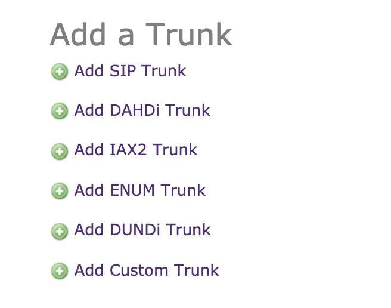
The trunk name can be anything, in our case AmazonChimeVoiceConnector.

For the Outbound CallerID we can use the format “Name”<+10000000000>, where 0000000000 is the number you just provisioned on the Amazon Chime side.
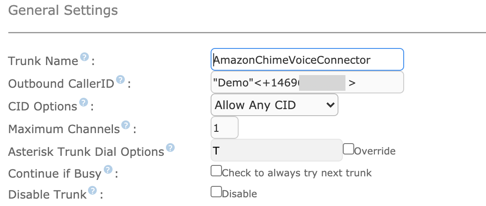
Under trunk name for outgoing settings I called it “ChimeOut”, also, here is where we are going to use the fields took notes from the termination portion of the Amazon Chime Voice Connector setup. This is what it looks like:

Trunk Name: ChimeOut

```
host=CHIME-OUTBOUND-HOSTNAME
username=USERNAME
secret=PASSWORD
type=peer
qualify=yes
```

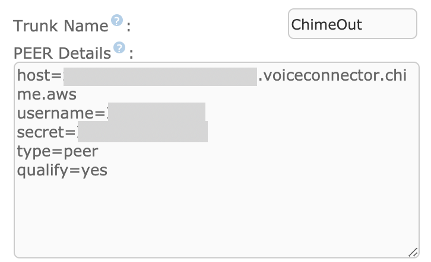
As for the Incoming settings, I named my trunk ChimeIn, and these are the contents:
User Context: ChimeIn

```
context=from-trunk
type=friend
insecure=invite
```

Click on Submit Changes on the bottom.

When the form reloads, you will see a pink ribbon with the message “Apply changes”, in order to apply the chages it has to be clicked.
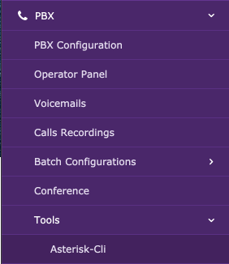
We can check the current status of our newly created trunk by clicking under PBX, Tools, Asterisk-Cli and executing the following command:

`sip show peers`
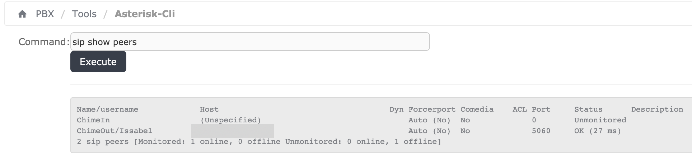
### Creating SIP extension for testing

We are going to click on PBX, PBX configuration, Extensions. On the Add an Extension screen, click on the Generic SIP device and click on the “Submit” button.
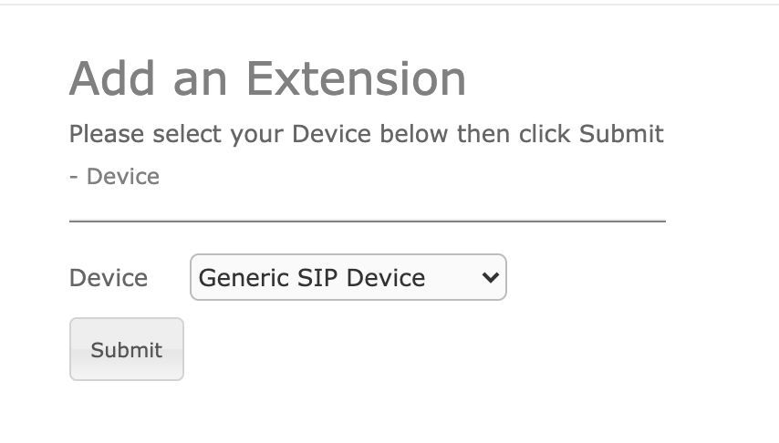
For user extension I’m using the number 100, for Display Name I’m entering Test Extension
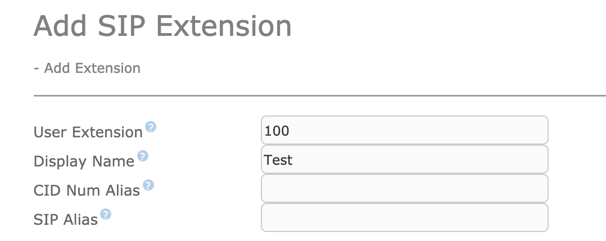
Make user that under device options you set the nat option to Yes:
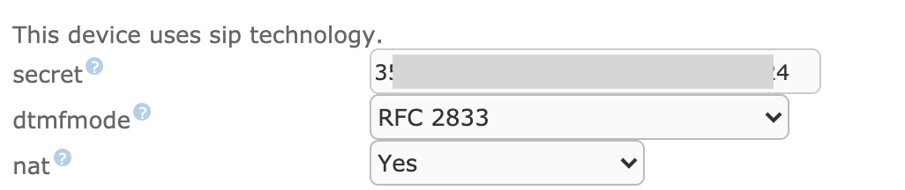
Click on Submit and then on Apply changes.

Setting up an inbound route

Final step on the setup flow is to setup an inbound route that will route our incoming calls to the extension we just had setup.

In order to create an Inbound route, click on PBX, PBX Configuration, and in the internal menu click on Inbound routes:
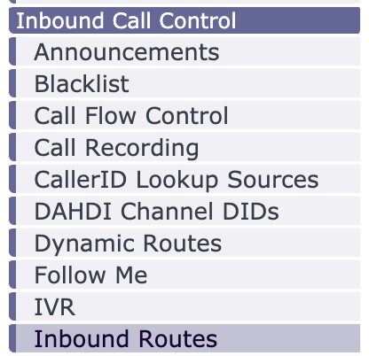
Because we will only be getting calls for this demo, I will only fill the Description and will set up the destination as Extensions -> <100> Test
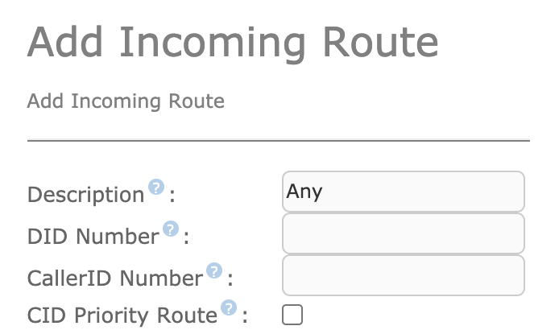
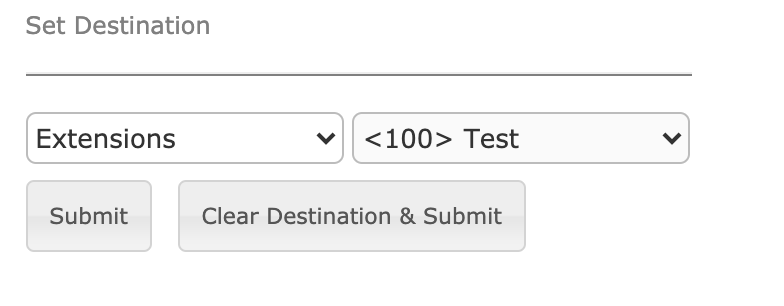
Click on Submit and apply changes.

### Creating an outbound route

We may also want to test our demo by dialing out, so we are going to create an outbound route.

Click on PBX, PBX Configuration and click on Outbound Routes:
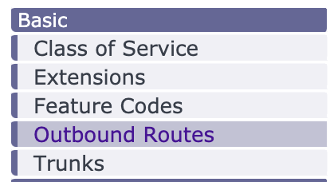
I will call my route ChimeVoiceConnector
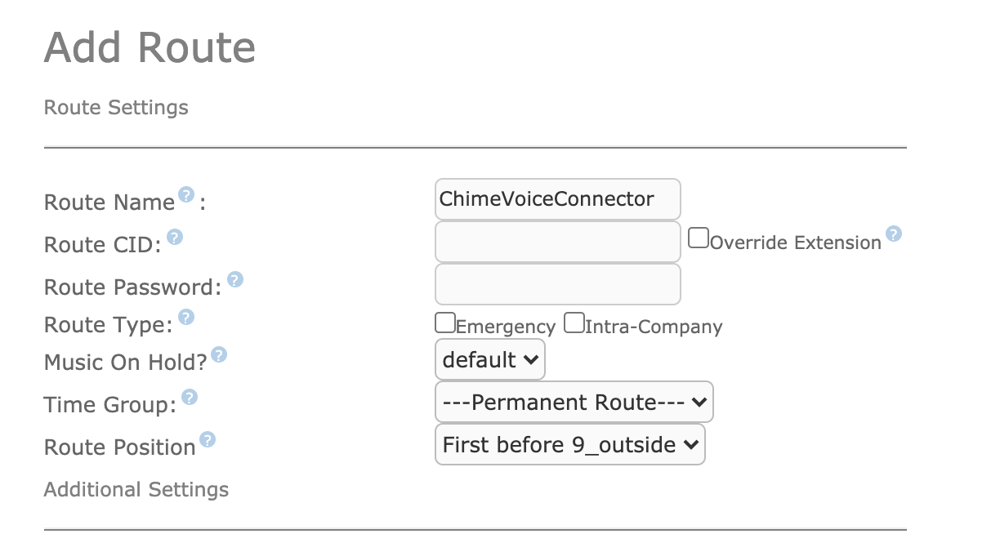
For the Dial pattern I will add + as the prepend prefix and 1XXXXXXXXXXas pattern for calls in the US.
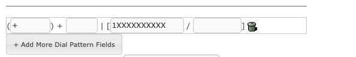
This way I can dial the numbers without needing to add the +1 expected by Amazon Chime.

On the Turnk Sequence for Matched Routes, select the AmazonChimeVoiceConnector trunk.
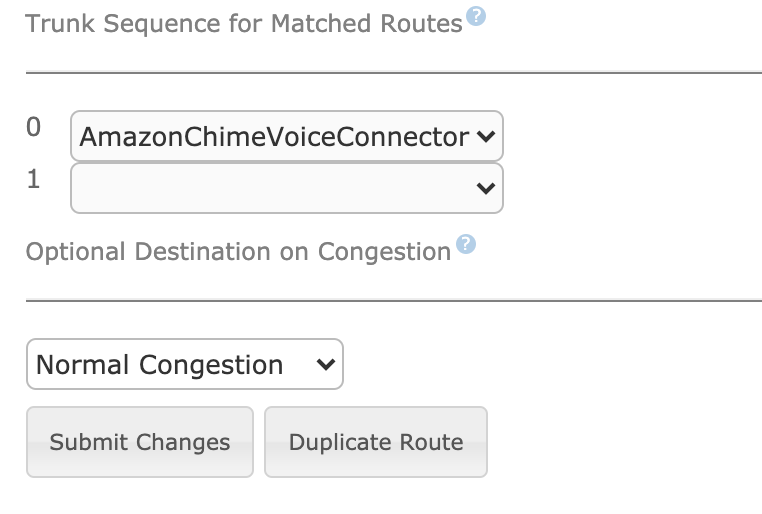
Afterwards click on Submit changes and Apply changes.

### Setting up the external IP of our Issabel Server

Click on PBX, Asterisk Sip Settings:
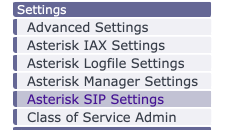
Under NAT settings click on the “Auto Configure” button.
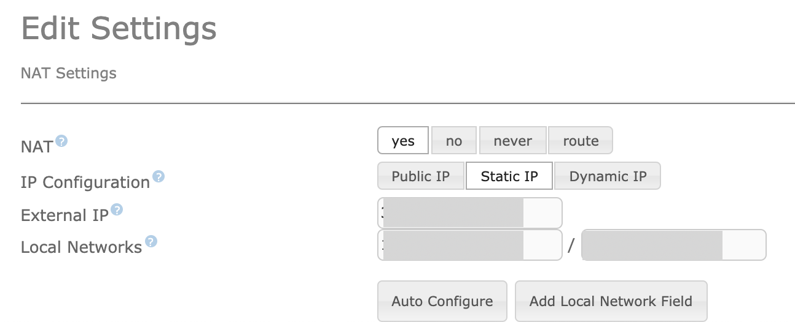
Click on submit and then on Apply Changes.

### Setting up a Softphone

For this stage you can use any IP Phone or softphone. In my case I will use Linphone an open source VOIP project.

After downloading and installing it I will set it up using my Issabel server’s IP as SIP domain, my extension number (100) as the username and the password I chose.

In my case the configuration screen will look similar to this:
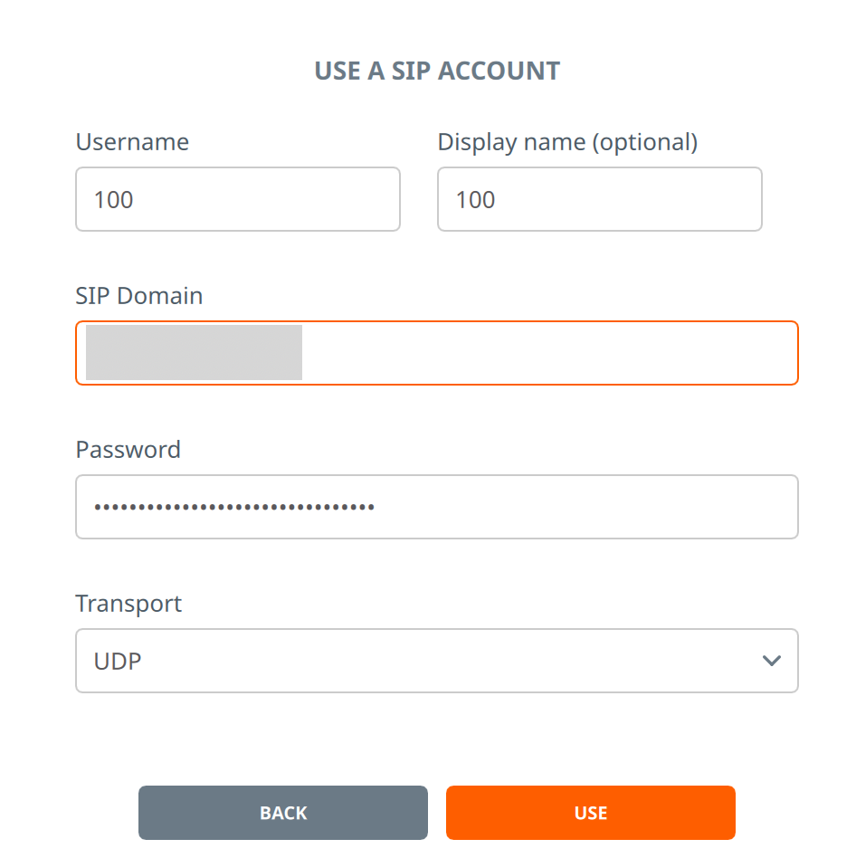
